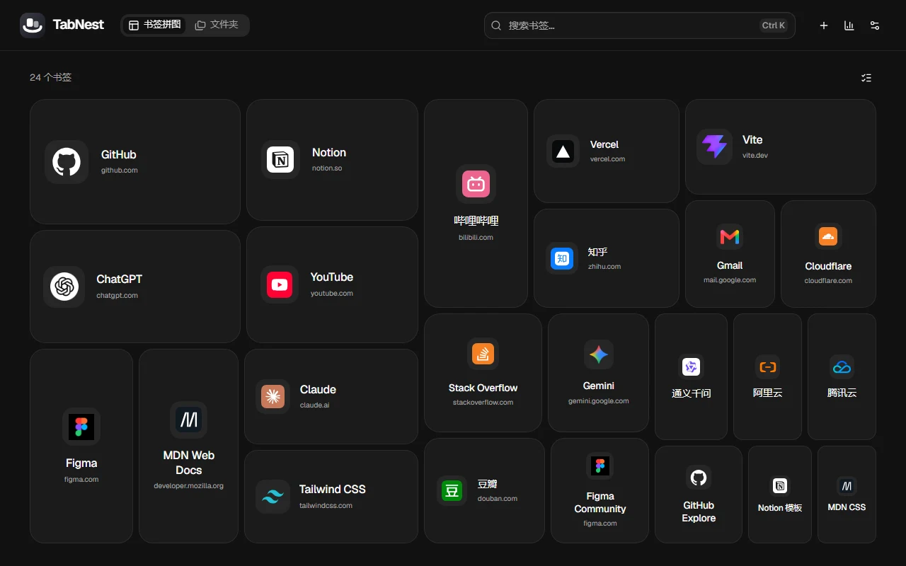
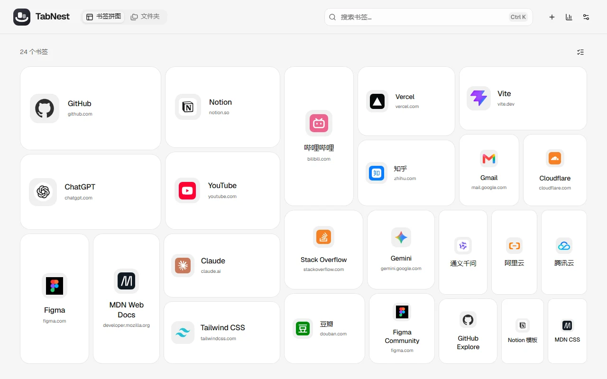
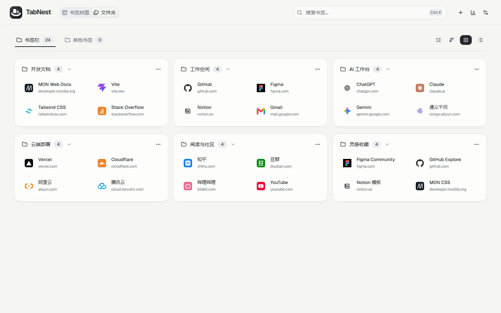
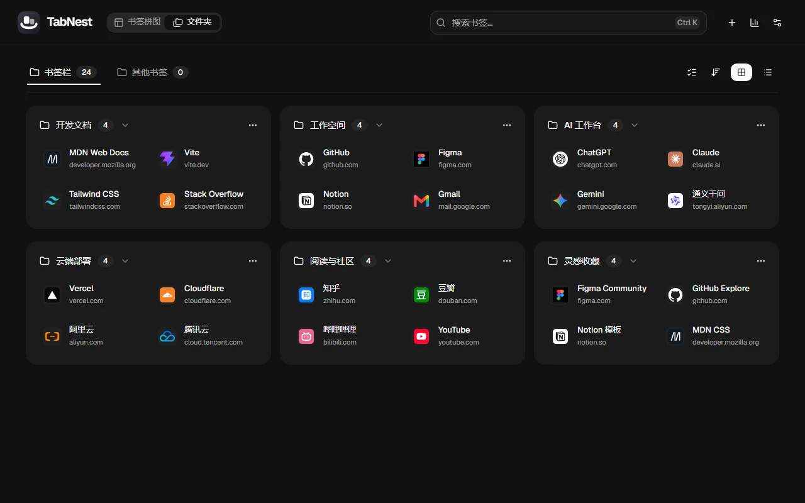
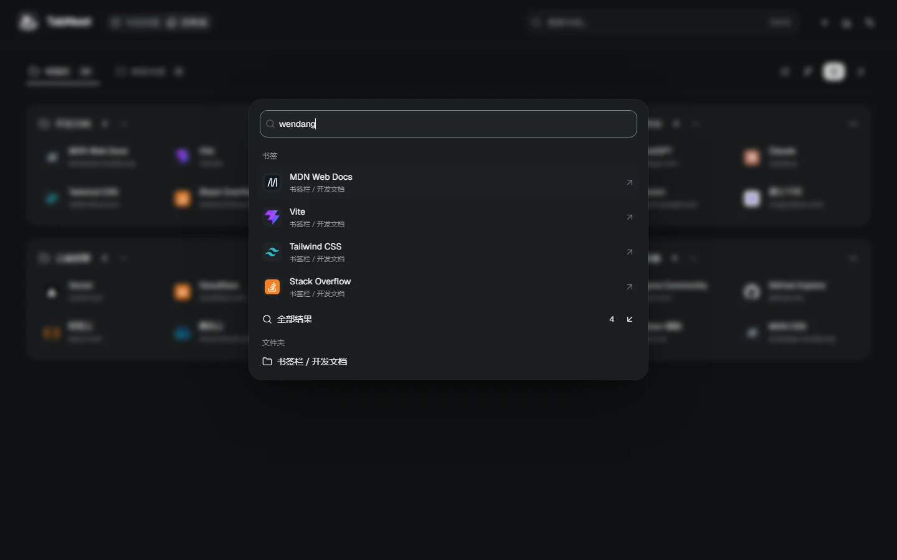

# TabNest

**让常用书签自然浮现，让收藏保持有序。**

TabNest 是一个本地运行的 Chrome 新标签页扩展。用随点击热度变化的书签拼图浏览收藏，用文件夹管理真实目录，再用中文、拼音或首字母快速找到目标。

基于 React 19、TypeScript、shadcn/ui · Radix Nova 和 Manifest V3。没有账号、广告或后台业务服务。



## 两种视图，一套书签

### 书签拼图

正方形、横向和纵向卡片交错排列。你在 TabNest 中打开书签的次数越多，它就越突出；附近低热度卡片缩小让位，保留最小点击区域。点击改变面积，刷新保持布局记忆。

图标、标题和域名按卡片空间自适应。所有书签都能通过连续滚动访问，极热门书签不会挤掉其他收藏。



### 文件夹

直接呈现 Chrome 的书签目录。桌面宽度采用三列区块，小屏自动适配；支持折叠、网格与列表、拖放排序、跨目录移动和批量整理。新标签页直接恢复上次视图与目录。

| 浅色 | 深色 |
| --- | --- |
|  |  |

## 搜索与整理

- **统一搜索**：`Ctrl K` / `⌘ K` 打开，搜索标题、网址、目录、拼音和首字母；多个关键词分别高亮。书签、文件夹、操作分组展示，超过 50 条可进入全部结果。
- **快捷操作**：从搜索面板新建书签、定位目录、导入、导出、查看统计或最近删除。方向键选择，回车执行，`Esc` 返回。
- **重复整理**：按网址分组，显示真实目录，选择保留项后预览删除内容。不同协议、查询参数和片段保留区别。
- **本地迁移**：导入、导出浏览器通用 HTML 或 JSON；导入先预检，再写入新建文件夹。JSON v5 保留文件夹与书签的混排顺序，兼容 v2–v4。
- **删除恢复**：普通删除先保存恢复记录，支持撤销与最近删除。记录最多 20 次、4 MB；单次超过容量时阻止普通删除，并提供导出及独立永久删除确认。



以上截图由 [固定的公开测试书签](tools/docs-screenshots.mjs) 生成，未使用个人浏览器书签或个人配置。

## 本地安装

需要 Node.js **22.12+**，Chrome **114+** 或兼容的 Chromium 浏览器。

```bash
git clone https://github.com/multi-zhangyang/tabnest.git
cd tabnest
npm ci
npm run build
```

1. 打开 `chrome://extensions`；Edge 使用 `edge://extensions`。
2. 开启「开发者模式」，点击「加载已解压的扩展程序」。
3. 选择项目的 `dist` 目录，打开新标签页。

更新代码并重新构建后，在扩展管理页点击重新加载。如果已有 ZIP 安装包，直接解压并加载解压后的目录即可，无需 Node.js。

`npm run dev` 提供网页预览，使用独立样例数据；安装后的扩展使用真实 Chrome 书签。不要直接双击 `index.html`。

## 使用细节

| 操作 | 入口 |
| --- | --- |
| 搜索书签与操作 | 顶栏搜索 / `Ctrl K` / `⌘ K` |
| 新建书签、文件夹 | 顶栏 `＋` |
| 编辑、复制、移动、删除 | 书签右键菜单 |
| 多选整理 | 视图右上角选择按钮 |
| 统计与重复整理 | 顶栏统计 |
| 导入、导出、最近删除 | 设置 / 搜索面板 |
| 切换亮暗主题 | 设置；非输入状态按 `D` |

隐藏滚动条，保留滚轮、触控板、触摸与键盘滚动。弹窗固定操作区，短窗口内表单独立滚动；开关弹窗保持背景宽度和位置。支持系统「减少动态效果」。

## 数据属于本地

Chrome 书签树是唯一书签来源，不维护独立云端副本。热度只统计在 TabNest 中触发的打开操作，不读取浏览历史；相同网址共享计数，正式扩展从零开始。

设置、热度和恢复记录保存在本地。完整 JSON 备份包含书签、目录、设置、热度和主题；普通书签导出只含目录与书签。导入及恢复会生成新的 Chrome 节点 ID。

网站图标优先使用内置资源和 Chrome 图标服务；只有开启「在线图标」才直接请求网站图标。Chrome 自身的账号同步由浏览器管理。

更多内容：[隐私说明](docs/privacy.md) · [架构与数据说明](docs/architecture.md)。

## 开发与验证

```bash
npm run dev               # 本地样例预览
npm run lint              # 静态检查
npm test                  # 数据、迁移、布局及故障回滚
npm run build             # TypeScript 与生产构建
npm run check             # 完整自动验收
npm run docs:screenshots  # 使用固定测试数据更新 README 图片
npm run release           # 验收后生成 ZIP、SHA-256 与发布报告
```

浏览器测试自动查找 Chrome，也可设置 `CHROME_PATH`。测试使用临时浏览器配置，不读取个人书签。截图、测试报告和安装包输出到 `artifacts/`；README 图片位于 `docs/images/`。

`npm run check` 覆盖真实 MV3 加载、数据恢复、中文搜索、弹窗与滚动、亮暗响应式界面、新标签页首帧、逐帧面积变化和大规模性能。布局与搜索在 1000 条以上使用本地 Worker，长列表按视口渲染。

发布门禁：ZIP 小于 **2 MB**，首屏静态 JavaScript 合计 gzip 小于 **250 KB**。GitHub Actions 在 Windows、Linux 和最低 Chrome 版本运行检查，产物可从对应工作流下载；不自动发布到商店。

[2.6 升级验收](docs/upgrade-2.6.md) · [2.6.1 交互修正](docs/upgrade-2.6.1.md) · [性能记录](docs/performance-2.6.md)
