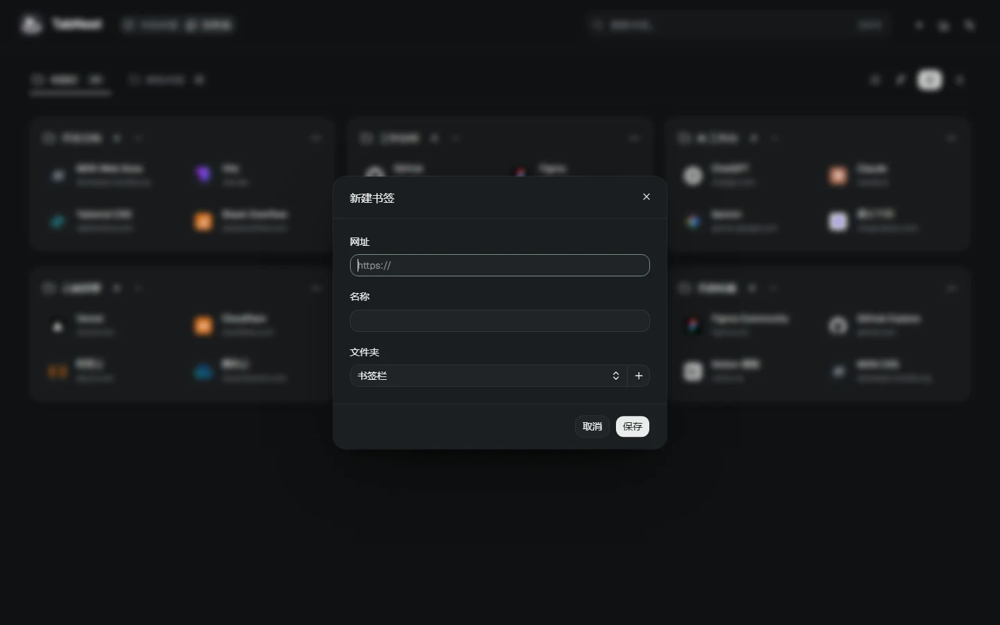

# 2.6.1 交互修正

日期：2026-09-28。包含 [2.6 本地产品升级](upgrade-2.6.md) 的全部实现。

## 新标签页首帧

修复已保存文件夹视图时，新建标签页仍先选中默认拼图、随后切回文件夹的问题。原因是首次 React 渲染早于异步偏好读取。

导航现在等待偏好读取后首次呈现正确选中态，读取期间保留占位；初次选中没有过渡动画。用户主动切换和跨页偏好同步继续有效。旧存储中的 `heat / zones` 值保持兼容，无需重新选择。

新增真实扩展回归：两种视图 × 正常／延迟 300ms 读取 × 新建／刷新，共 8 个逐帧场景；另覆盖主动切换与跨页同步、初始化期间的并发偏好更新。10 项通过，没有错误首帧或初始选中动画。证据：`artifacts/startup-check.json`。

## 名称与焦点

- 「热度云图」更名为「书签拼图」，「分区」更名为「文件夹」。主导航、无障碍名称、操作状态及文档用词同步。
- Input、Textarea、InputGroup 用一像素边框表示焦点，移除三像素外部光环；亮暗主题使用独立语义色。保留自动聚焦、键盘访问与错误边框。
- 搜索触发器悬停使用边缘反馈，取消外部发光。启动读取期间不显示错误的零书签计数。
- 原生滚动和隐藏滚动条保留；弹窗焦点、背景锁定和滚动位置延续既有行为。

## README 与图片

README 重新整理为产品视图、搜索整理、安装、操作、数据边界和开发验证。展示亮暗拼图、亮暗文件夹及拼音搜索，共 5 张截图。

截图脚本 `tools/docs-screenshots.mjs` 在临时浏览器配置和本地预览内创建 24 条公开样例书签，阻断外部请求，不读取个人 Chrome 目录。共生成 6 张 WebP 图片（含本页表单图），文件位于 `docs/images/`；可用 `npm run docs:screenshots` 复现。

## 验证与交付

静态检查、TypeScript 与生产构建通过；46 项数据与算法测试、浏览器回归及真实 MV3 检查通过。10 项启动检查、34 项界面检查、57 项滚动检查、13 组产品流程及 12 组响应式／拼图检查通过。滚动与弹窗逐帧最大背景位移为 0。

性能覆盖 500、5000、20000 个书签及最高 2000 个文件夹，各运行五次。5000 条样本的最慢 P95：首屏 548ms、搜索 62ms、热度反馈 51ms，最大挂载 185 个书签。详见 [性能记录](performance-2.6.md)。性能及界面检查完成后，最终的并发启动修正另行通过 lint、构建与 10 项原生启动回归；未重复不受影响的性能样本。

本地验收证据位于 `artifacts/check-2.6.1.log`、`check-2.6.1-followup.log`、`check-2.6.1-ui.log` 及各专项 JSON 报告。初次运行中修正了测试页未置前、隐藏 outline 的判定两个测试问题；新增并发回归先在旧构建上复现失败，再在最终构建上通过。

历史兼容范围见 [2.6 验收](upgrade-2.6.md)。本次原生启动测试运行于 Windows Chrome 154；不将历史基础兼容检查等同于本次完整平台回归。

安装包：`artifacts/TabNest-v2.6.1.zip`，666707 字节；首屏静态 JavaScript 合计 gzip 为 174305 字节。两项均通过发布门禁。

SHA-256：`b646af5116965e60dfe2ba84632bc7d13bfca28c5f8619df7a3f0210e3546e7c`。
